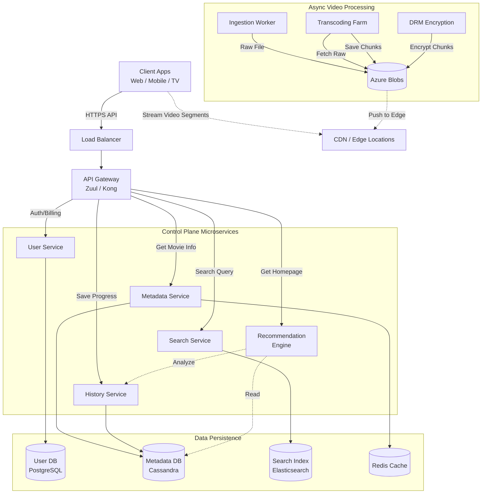

# Video-on-Demand (VoD) Platform

**Project Name:** Netflix Clone Architecture  
**Document Version:** 1.0  
**Status:** Draft  

---

## 1. Executive Summary
This document outlines the architectural design for a scalable, high-availability video streaming platform similar to Netflix. The system is designed to handle millions of concurrent users, supporting high-definition streaming with low latency, adaptive bitrate playback, and personalized content discovery.

---

## 2. Requirements Analysis

### 2.1 Functional Requirements
1.  **User Account Management:** User registration, authentication, and multiple profiles per account.
2.  **Content Management:** Admins can upload video raw files; the system processes them automatically.
3.  **Search & Discovery:** Users can search by title, genre, or cast and receive personalized recommendations.
4.  **Playback:** Users can stream videos with Adaptive Bitrate Streaming (ABR).
5.  **Interactivity:** Features like "Add to Watchlist," "Resume Watching," and "Like/Dislike."

### 2.2 Non-Functional Requirements
1.  **High Availability:** System must aim for 99.99% uptime.
2.  **Scalability:** Capable of scaling horizontally to support traffic spikes (e.g., Friday night releases).
3.  **Low Latency:** Playback must start within < 200ms.
4.  **Reliability:** Zero data loss for billing and user watch history.
5.  **Global Reach:** Content must be served from edges close to the user.

---

## 3. High-Level Architecture

The system follows a **Microservices Architecture** pattern. It is strictly divided into the **Control Plane** (API/Business Logic) and the **Data Plane** (Video Streaming).

### 3.1 Architecture Diagram (Mermaid)



---

## 4. Component Design Details

### 4.1 Client & Entry Point
*   **Load Balancer (ALB/Nginx):** Handles SSL termination and distributes traffic across API Gateway instances.
*   **API Gateway (Zuul / Kong):**
    *   **Authentication:** Validates JWT tokens before requests reach microservices.
    *   **Rate Limiting:** Prevents abuse (e.g., 100 requests/sec per IP).
    *   **Response Aggregation:** Combines data from *Metadata* and *History* services into a single JSON response to save mobile battery and bandwidth.

### 4.2 Microservices Breakdown
The backend is split into decoupled domains:

| Service | Responsibility | Technology Stack | Database |
| :--- | :--- | :--- | :--- |
| **User Service** | Auth, Profile management, Billing via Stripe/PayPal. | Node.js / C# | **PostgreSQL** (ACID required) |
| **Metadata Service** | CRUD operations for Movies, Episodes, Cast, Genre. | Go / Java | **Cassandra** (High Read availability) |
| **Search Service** | Inverted index for fuzzy search (e.g., "Avngers" -> "Avengers"). | Java | **Elasticsearch** |
| **History Service** | Tracks exactly where a user stopped watching (Time-series data). | C# / Go | **Cassandra** (Write-heavy optimization) |
| **Recommendation** | Batch processing user logs to generate "For You" lists. | Python / Spark | **Hadoop / NoSQL** |

### 4.3 Video Ingestion Pipeline (The "Upload" Flow)
This process runs asynchronously when an admin uploads a movie.

1.  **Raw Upload:** File uploaded to **S3 (Ingest Bucket)**.
2.  **Validation:** Check file integrity and format (e.g., `.mov`, `.mp4`).
3.  **Transcoding (FFmpeg):** The "Transcoding Farm" pulls the raw file and creates multiple versions:
    *   **Resolutions:** 4K, 1080p, 720p, 480p (to support different screen sizes).
    *   **Codecs:** H.264 (older devices), H.265/HEVC (newer devices, better compression).
4.  **Chunking:** The video is sliced into **4-second segments** (chunks) for HLS/DASH protocols.
5.  **Encryption (DRM):** Digital Rights Management is applied to chunks to prevent piracy.
6.  **Distribution:** Final chunks and Manifest files are pushed to **S3 (Public Bucket)** and warmed up in the **CDN**.

---

## 5. Streaming Strategy (Video Delivery)

We do not stream from the backend servers; we stream from the Edge.

### 5.1 Adaptive Bitrate Streaming (ABR)
This logic ensures the video never buffers, even if the internet connection fluctuates.

1.  **Manifest File (.m3u8 / .mpd):** The client downloads this "menu" first. It lists the URLs for every chunk in every resolution.
2.  **Bandwidth Detection:** The video player calculates the user's download speed.
3.  **Dynamic Switching:**
    *   *User has 50Mbps:* Player requests **1080p** chunks.
    *   *User drops to 2Mbps:* Player requests the next chunk in **480p**.
    *   *Result:* The image gets slightly blurry, but playback **does not stop**.

### 5.2 CDN / Open Connect
*   **Geography:** We place video files in data centers (Points of Presence) close to ISPs.
*   **Routing:** If a user is in London, DNS routing sends them to the AWS London Edge location, not the US server.

---

## 6. Data Architecture

### 6.1 Database Selection Strategy (Polyglot Persistence)

| Data Type | Recommended DB | Justification |
| :--- | :--- | :--- |
| **User / Billing** | **PostgreSQL (RDBMS)** | Requires ACID compliance. You cannot lose money or corrupt account data. |
| **Movie Metadata** | **Cassandra / DynamoDB** | High availability is key. Requires massive read throughput. Eventual consistency is okay. |
| **Watch History** | **Cassandra** | Extremely high write throughput (millions of "heartbeats" per second). |
| **Search Index** | **Elasticsearch** | Specialized for text search, fuzziness, and autocomplete. |
| **Caching** | **Redis** | Stores user sessions and "Trending Now" lists to reduce DB load. |
| **Video Blobs** | **Azure Blobs** | Cheap, infinitely scalable storage for large video files. |

### 6.2 Data Schema Example (Metadata Service)
```json
// Stored in NoSQL (Cassandra)
{
  "movie_id": "mv_8812",
  "title": "Stranger Things",
  "synopsis": "When a young boy vanishes...",
  "maturity_rating": "TV-14",
  "genres": ["Sci-Fi", "Horror"],
  "manifest_url": "https://cdn.netflix.com/mv_8812/master.m3u8",
  "cast": [
    { "name": "Millie Bobby Brown", "role": "Eleven" }
  ]
}
```

---

## 7. Scalability & Reliability

### 7.1 Database Sharding
To handle 100M+ users, single database instances are insufficient.
*   **User DB:** Sharded by `UserID`.
*   **Metadata DB:** Sharded by `VideoID`.
*   **History DB:** Sharded by `UserID` (so all history for one user stays on one node).

### 7.2 Geo-Replication
*   **Data:** Databases replicate data across Region A (US-East) and Region B (EU-West).
*   **Traffic:** If US-East goes down, Route53 (DNS) redirects all traffic to US-West.

### 7.3 Fault Tolerance (Circuit Breaker Pattern)
*   If the **Recommendation Service** crashes or times out:
    *   The API Gateway triggers a "Fallback."
    *   Instead of an error page, the user sees a cached "Generic Popular List."
    *   **Impact:** The user barely notices the failure.

---

## 8. API Contract Design (REST)

The backend exposes a RESTful API for the frontend client (React/Mobile).

### 8.1 Core Endpoints

**1. Home Feed**
*   **GET** `/api/v1/feed`
*   **Headers:** `Authorization: Bearer <token>`
*   **Response:** JSON list of categories ("Trending", "Action", "Watch It Again").

**2. Movie Details**
*   **GET** `/api/v1/movies/{movieId}`
*   **Response:** Metadata, Cast, and the **Manifest URL** for the video player.

**3. Playback Heartbeat**
*   **POST** `/api/v1/history`
*   **Payload:** `{ "movieId": "mv_8812", "timestamp": 845, "status": "playing" }`
*   **Frequency:** Client sends this every 30 seconds to save progress.

**4. Search**
*   **GET** `/api/v1/search?q=spider`
*   **Response:** List of movies matching "spider" (Spiderman, Spiderwick Chronicles, etc.).