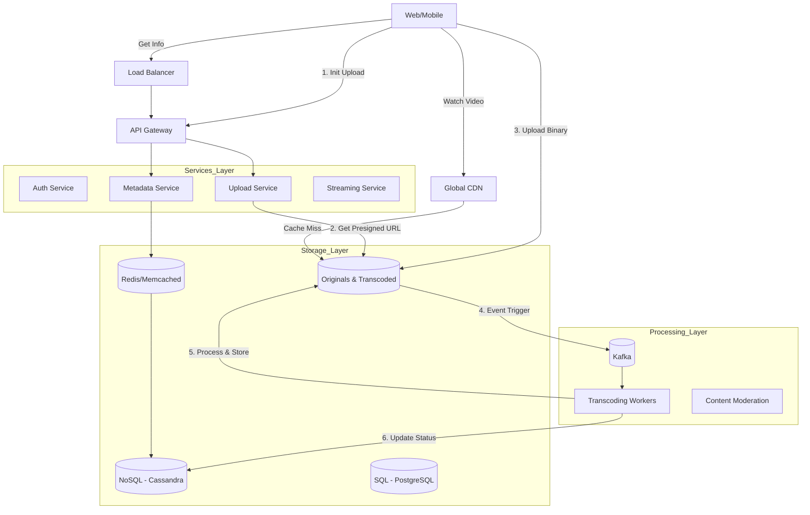
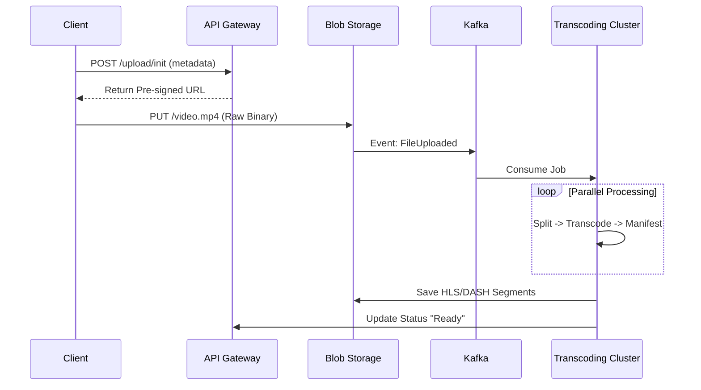


# System Design: YouTube (Video Sharing Platform)
**Role:** Senior Staff Software Engineer
**Focus:** Scalability, Reliability, Cost Optimization, and Event-Driven Architecture.

---

## 1. Requirements & Scope Clarification
*Before designing, we establish the boundaries of the system to demonstrate business prioritization.*

### Functional Requirements
1.  **Upload:** Users can upload videos (various formats/sizes).
2.  **View:** Users can stream videos smoothly (low latency, no buffering).
3.  **Metadata:** Users can view video stats (titles, likes, view counts).
4.  **Search/Recommendations:** (Out of scope for this session, focusing on core infrastructure).

### Non-Functional Requirements
1.  **Availability:** High (99.99%) - Dropped requests mean lost ad revenue.
2.  **Reliability:** Zero data loss for uploaded videos.
3.  **Latency:** "Time to First Byte" (TTFB) must be minimal for playback.
4.  **Consistency:** Eventual consistency is acceptable for view counts/likes. Strong consistency for user auth/billing.

### Scale Estimates (Back-of-the-envelope)
*   **DAU:** 100 Million active users.
*   **Uploads:** 500 hours of video per minute.
*   **Storage:** 500 hours * 60 mins * 50MB/min (compressed) ≈ **1.5 PB / day** new content.
*   **Bandwidth:** The read-to-write ratio is extremely high (100:1 or higher).

---

## 2. High-Level Architecture
We avoid a monolith. The system is split into **Write Path** (Ingestion) and **Read Path** (Delivery).

### Component Diagram

---

## 3. Detailed Component Design

### A. The "Write" Path: Uploads & Transcoding
*Challenge:* Handling massive files without blocking threads.
*Solution:* Asynchronous processing with Pre-signed URLs.

**The Workflow:**
1.  **Direct-to-Cloud Upload:** Client requests a pre-signed URL from the `Upload Service`. Client uploads directly to Blob Storage (S3/GCS). This keeps our API servers lightweight.
2.  **Event-Driven Trigger:** Upon upload completion, S3 triggers an event to a **Kafka** topic.
3.  **DAG (Directed Acyclic Graph) Processing:** We don't just "convert" the video. We run a workflow (e.g., via AWS Step Functions or Airflow):
    *   **Validation:** Check file integrity.
    *   **Chunking:** Split video into 2-minute segments for parallel processing.
    *   **Transcoding:** Convert chunks into different resolutions (360p, 720p, 4K) and formats (H.264, VP9).
    *   **Thumbnail Generation:** Extract images.
    *   **Stitching:** Create the manifest file (`.m3u8` or `.mpd`).

### B. The "Read" Path: Streaming
*Challenge:* User network speeds vary.
*Solution:* **Adaptive Bitrate Streaming (ABR)**.

1.  **Protocol:** We use **HLS (HTTP Live Streaming)** or **DASH**. We do not stream over a single persistent TCP connection. We serve small chunks over HTTP.
2.  **Manifest Files:** The player downloads a manifest file. This file lists the URLs for the video chunks in every available resolution.
3.  **Client-Side Logic:** The client player detects bandwidth.
    *   *High BW:* Download 1080p chunks.
    *   *Network Drop:* Automatically switch next request to 360p chunk.
4.  **CDN Strategy:**
    *   **Edge Caching:** Popular content lives at the Edge (ISP/local geography).
    *   **Long-tail Content:** Less popular videos are fetched from the Origin (S3) only when requested.

### C. Database & Data Model
*Challenge:* Massive read volume and write throughput for stats.

1.  **User Data (ACID required):** Use **PostgreSQL** or **Spanner**.
    *   Users, Billing, Settings.
2.  **Video Metadata (High Scale):** Use **Cassandra** or **DynamoDB**.
    *   **Partition Key:** `video_id` (Ensures metadata for one video lives on one node).
    *   Schema: `video_id`, `title`, `description`, `uploader_id`, `s3_url`.
3.  **View Counts (High Write Throughput):**
    *   Problem: Updating the DB on *every* view kills the database.
    *   Solution: **Write-Back Caching**. Increment a counter in Redis. Flush to Cassandra every ~10 seconds.

---

## 4. Senior Staff Deep Dives (The Differentiators)

### 1. Cost Optimization (Tiered Storage)
Storing 1.5PB/day is expensive. We cannot keep everything in "Hot" storage.
*   **Hot Tier (S3 Standard):** Videos uploaded in the last 30 days or >1000 views/day.
*   **Warm Tier (S3 Infrequent Access):** Videos > 1 year old with occasional views.
*   **Cold Tier (Glacier/Tape):** Videos with 0 views in 2 years.
*   **Deduplication:** Check hash of uploaded file. If it exists, just create a reference pointer. Don't store it twice.

### 2. Reliability & Fault Tolerance
*   **Thundering Herd:** If a celebrity uploads a video, millions of users request it instantly.
    *   *Solution:* **Request Coalescing** at the Cache/CDN layer. If 10,000 requests come for the same key, let 1 go to the origin, and serve the response to the other 9,999.
*   **Region Failover:** Data is replicated across `us-east`, `us-west`, and `eu-central`. If `us-east` transcoding service dies, Kafka consumers in `us-west` pick up the backlog.

### 3. Safety (Content Moderation)
*   The upload pipeline must include a **Moderation Service**.
*   Before the video is marked `public`, AI models (frame sampling) check for copyright/NSFW content. This is a step in the DAG.

---

## 5. Connecting to GEICO (The "Why Hire Me?" Section)

*   **Parallels to Insurance:**
    *   **Video Ingestion** $\rightarrow$ **Claims Evidence Ingestion**: Just like uploading raw video, GEICO users upload photos/videos of accidents. The **Pre-signed URL + Async Processing** pattern ensures the app remains responsive even with poor connectivity at an accident scene.
    *   **Transcoding Workflow** $\rightarrow$ **Claims Adjustment Workflow**: The DAG pipeline (Validation -> Transcoding -> Thumbnail) is identical architecturally to a Claims pipeline (Fraud Check -> Coverage Verify -> Adjuster Assignment -> Payment).
    *   **Availability**: Just as YouTube cannot fail during the Super Bowl, GEICO systems cannot fail during catastrophic weather events (hurricanes) when traffic spikes.

---

### Summary of Technologies
*   **Languages:** Go/Java (High throughput services), Python (Orchestration/AI).
*   **Compute:** Kubernetes (Auto-scaling workers).
*   **Storage:** S3 (Blobs), Cassandra (Metadata), Redis (Cache).
*   **Messaging:** Kafka (Decoupling services).
*   **Delivery:** Cloudflare/Akamai CDN.